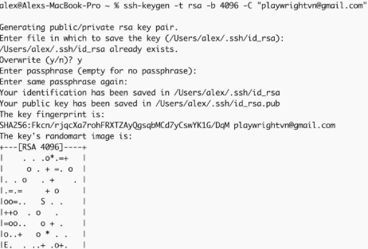
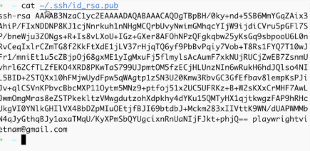
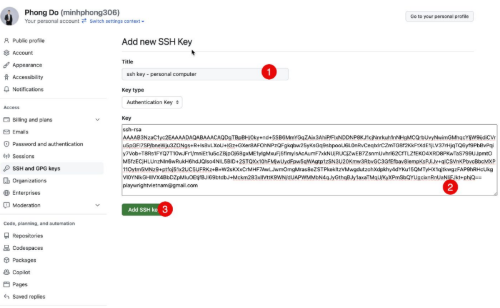

# Playwright + TypeScript: A Quick Overview

## What is Playwright?
Playwright is a modern end‑to‑end (E2E) testing framework from Microsoft for automating web browsers. It:
- Drives **Chromium, Firefox, and WebKit** with a single API (headed or headless).
- Offers **auto‑waiting** for elements and network to be ready, reducing flaky tests.
- Provides **Web‑first assertions**, **locators**, and powerful **tracing**, **video/screenshot** capture.
- Includes a built‑in **Playwright Test** runner with parallelism, retries, reporters, and fixtures.
- Supports multiple languages (TypeScript/JavaScript, Python, Java, .NET).
- Latest Version: Playwright v1.52 (stable release)

## Why choose Playwright + TypeScript?
- **Ecosystem fit**: TypeScript integrates naturally with Node.js tooling (Prettier, ESLint, ts-node, tsx, pnpm/yarn/npm).
- **Modern Syntax**: Clean, simple, and expressive API (async/await, locators, role-based selectors).
- **Easy to Learn**: Official docs, codegen tool (npx playwright codegen), and clear error messages.
- **Beginner-Friendly**: Minimal boilerplate, good defaults, and built-in test runner make it accessible.
- **Lower Barrier to Entry**:
    - One install = browsers + test runner ready.
    - Supports TypeScript out of the box.
    - Rich debugging tools (trace viewer, screenshots, videos).
    - Cross-platform (Windows, macOS, Linux, CI/CD).

## Pros and Cons

### Pros
- **Cross‑browser parity**: One test covers Chromium, Firefox, WebKit.
- **Flake‑resistant**: Auto‑waiting and web‑first assertions reduce timing issues.
- **Rich test runner**: Parallelism, shards, retries, reporters (HTML/JUnit/Allure via plugins).
- **Robust isolation**: Contexts and storage state enable clean auth and multi‑user scenarios.
- **Strong diagnostics**: Traces, screenshots, videos, network logs, and codegen.
- **Fast authoring**: Codegen and locators accelerate writing stable tests.
- **Mobile emulation**: Device profiles and geolocation/permissions stubbing.
# Getting Started: NVM & Node.js (For Automation Testing)
## What is NVM?
- NVM = Node Version Manager → A tool to install and manage multiple Node.js versions on the same machine.
- Node.js = JavaScript runtime environment to execute code outside of the browser.
- Installation Options:
    1. Direct installation: Download Node.js directly and install.
    2. Via NVM: Recommended → easy to switch between Node.js versions.
- Choose NVM because it allows you to:
    - Quickly switch Node.js versions.
    - Keep projects isolated with the right Node.js version.
### Install NVM
- Option 1:
    - On macOS:
    ```typescript
    brew install nvm
    ```
    - On Windows:

        Download from: [nvm-windows releases](https://github.com/coreybutler/nvm-)
- Option 2:        
Install Node.js via NVM
    ```typescript
    nvm install v22.9.0
    nvm use v22.9.0
    ```
Common Issues & Fixes (Windows)
- Error: nvm not found
    - Rename folder:
    ```typescript
    C:\Program Files\nodejs  →  C:\Program Files\nodejsx
    ```
    - Restart your machine.
- Error: [node-gyp](https://minhphong306.wordpress.com/2023/01/19/huong-dan-fix-loi-cai-package-node-gyp-tren-window/)
### Install Playwright
- Create folder `pw-course`
- Run command:
    ```typescript
    npm init playwright@latest
    ```
- Run the test file `example.spec.ts`
### Install Git & GitHub
- On MacOS: (already has git)
- On Windows:
https://git-scm.com/downloads
    - Check installation
    - Config
### Install IDE (VSCode)
- Install Visual Studio Code: https://code.visualstudio.com/
- Install extension ○ Playwright extension: https://marketplace.visualstudio.com/items?itemName=ms-playwright.playwright
### Intergrate GitHub
SSH (Secure Shell) key is like a digital ID card used to prove your identity when connecting securely between two computers (for example: your laptop ↔ GitHub).
- It’s a pair of two keys:
    - Private key (stored only on your laptop, secret): `id_rsa`
    - Public key (shared, can be uploaded to GitHub): `id_rsa.pub`
- Stored at folder `~/.ssh` ("~" is presented home folder)

**1. Create SSH key**
```typescript
ssh-keygen -t rsa -b 4096 -C "your_email@example.com"
```
***Important: If SSH key already existed, check carefully before overwrite***


**2. Add SSH key**
- Get content of SSH key
    ```typescript
    cat ~/.ssh/id_rsa.pub
    ```
    
- Input content of SSH key into GitHub https://github.com/settings/ssh/new

### Push code to GitHub
- Create repository on GitHub
- Init repo:
    ```typescript
    git init
    ```
- Intergrate repro with Git:
    ```typescript
    git remote add origin <ssh_link_of_repo>
    ```
- Add code
    ```typescript
    git add .
    ```
- Add commit
    ```typescript
    git commit -m"init project"
    ```
- Push code
    ```typescript
    git push origin main
    ```